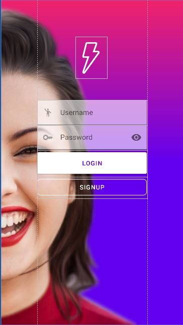
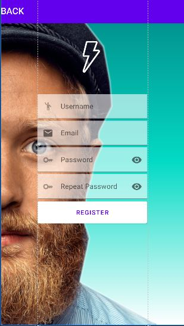
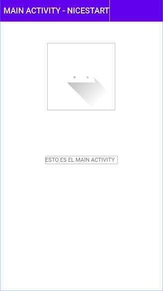
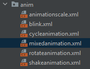
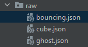
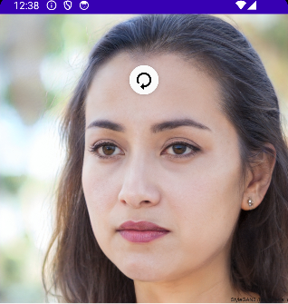
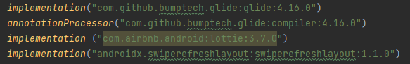

# Proyecto Android Studio - NiceStart 

Este proyecto de Android Studio es una aplicación simple que demuestra la navegación entre las pantallas de inicio de sesión, registro y la actividad principal. Aunque no incluye funcionalidades de autenticación, sirve como un ejemplo de flujo de navegación básico en una aplicación Android. NiceStart también dispone de algunos ejemplos de animaciones y una pantalla con una rueda de refresco implementada.

## Características

- **Pantalla de Inicio de Sesión (Login):** Permite a los usuarios acceder a la pantalla de registro o la actividad principal.

  

- **Pantalla de Registro (Register):** Los usuarios pueden navegar a esta pantalla para crear cuentas, aunque no se almacena información.

  
  

- **Actividad Principal (MainActivity):** Representa la página principal de la aplicación.

  
  

- **Animaciones personalizadas:** Se han realizado distintas animaciones de forma manual, aunque no son visibles en el estado actual del proyecto. Estas animaciones están aplicadas al logo incial del proyecto.

  
  
  
  
  
- **Animaciones con Lottie:** En una versión más actualizada del proyecto se implementaron algunas animaciones con Lottie.

  
  
  
  

- **Pantalla para prueba de refresco (NoPeople):**

  
  

- **Dependencias externas para el correcto funcionamento del proyecto:**

  
  
 
  

