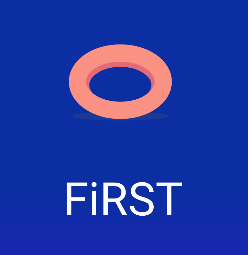

# Proyecto Android Studio - NiceStart 

Este proyecto de Android Studio es una aplicación simple que demuestra la navegación entre las pantallas de inicio de sesión, registro y la actividad principal. Aunque no incluye funcionalidades de autenticación, sirve como un ejemplo de flujo de navegación básico en una aplicación Android. **NiceStart** también dispone de algunos ejemplos de animaciones y una pantalla con una rueda de refresco implementada.

## Características

- **Pantalla de Inicio de Sesión (Login):** Permite a los usuarios acceder a la pantalla de registro o la actividad principal.


  

- **Pantalla de Registro (Register):** Los usuarios pueden navegar a esta pantalla para crear cuentas, aunque no se almacena información.

  
  

- **Actividad Principal (MainActivity):** Representa la página principal de la aplicación.

  
  

- **Animaciones personalizadas:** Se han realizado distintas animaciones de forma manual, aunque no son visibles en el estado actual del proyecto. Estas animaciones están aplicadas al logo incial del proyecto.

  
  
  
  


  El código de **mixedanimation** se ve asi:
  ```
  <?xml version="1.0" encoding="utf-8"?>
<set xmlns:android="http://schemas.android.com/apk/res/android"
    android:duration="500"
    android:fillAfter="true">
    <scale xmlns:android="http://schemas.android.com/apk/res/android"
        android:fromXScale="0"
        android:toXScale="1.5"
        android:fromYScale="0"
        android:toYScale="1.5"
        android:pivotX="50%"
        android:pivotY="50%">
    </scale>
    <rotate xmlns:android="http://schemas.android.com/apk/res/android"
        android:fromDegrees="1800"
        android:pivotX="50%"
        android:pivotY="50%"
        android:toDegrees="0">
    </rotate>
    <translate xmlns:android="http://schemas.android.com/apk/res/android"
        android:fromXDelta="2%"
        android:fromYDelta="-2%"
        android:interpolator="@anim/cycleanimation"
        android:toXDelta="5%"
        android:toYDelta="2%"
        android:startOffset="1000">
    </translate>
    <alpha
        android:fillAfter="true"
        android:fromAlpha="0.0"
        android:repeatCount="infinite"
        android:repeatMode="reverse"
        android:toAlpha="1.0" />
</set>
  ```
  
- **Animaciones con Lottie:** En una versión más actualizada del proyecto se implementaron algunas animaciones con Lottie.

  
  
  
  

- **Pantalla para prueba de refresco (NoPeople):**

  
  

- **Dependencias externas para el correcto funcionamento del proyecto:**

  
  
